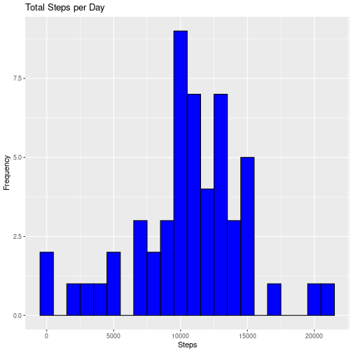
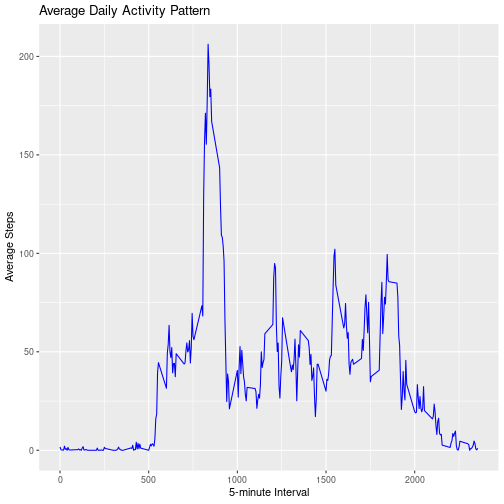
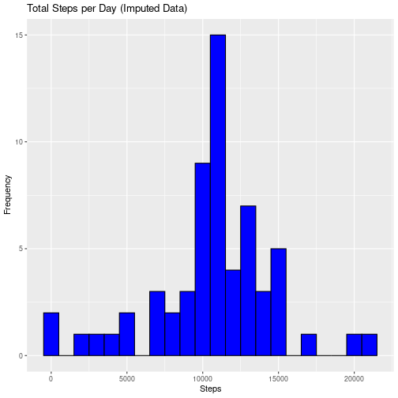
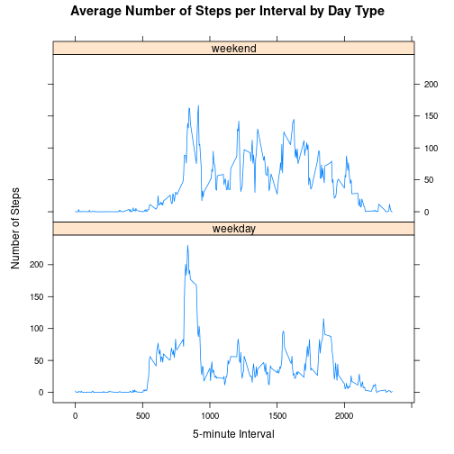

``` r
# Code to load and preprocess the data
if (!file.exists("activity.csv")) {
  temp <- tempfile()
  download.file("https://d396qusza40orc.cloudfront.net/repdata%2Fdata%2Factivity.zip", temp)
  unzip(temp)
  unlink(temp)
}

# Load the data
activityData <- read.csv("activity.csv")
```

``` r
# Code to calculate and plot total steps per day, and calculate mean and median
totalStepsPerDay <- aggregate(steps ~ date, data = activityData, sum, na.rm = TRUE)
library(ggplot2)
ggplot(totalStepsPerDay, aes(x = steps)) +
  geom_histogram(binwidth = 1000, fill = "blue", color = "black") +
  labs(title = "Total Steps per Day", x = "Steps", y = "Frequency")
```



``` r
meanSteps <- mean(totalStepsPerDay$steps)
medianSteps <- median(totalStepsPerDay$steps)
meanSteps
```

```
## [1] 10766.19
```

``` r
medianSteps
```

```
## [1] 10765
```

``` r
# Code to create time series plot of average daily activity pattern and identify max interval
averageStepsPerInterval <- aggregate(steps ~ interval, data = activityData, mean, na.rm = TRUE)
ggplot(averageStepsPerInterval, aes(x = interval, y = steps)) +
  geom_line(color = "blue") +
  labs(title = "Average Daily Activity Pattern", x = "5-minute Interval", y = "Average Steps")
```



``` r
maxInterval <- averageStepsPerInterval[which.max(averageStepsPerInterval$steps), ]
maxInterval
```

```
##     interval    steps
## 104      835 206.1698
```

``` r
# Code to impute missing values and analyze the impact
missingValues <- sum(is.na(activityData$steps))
missingValues
```

```
## [1] 2304
```

``` r
activityDataImputed <- activityData
activityDataImputed$steps[is.na(activityDataImputed$steps)] <- tapply(activityData$steps, activityData$interval, mean, na.rm = TRUE)[as.character(activityData$interval[is.na(activityData$steps)])]

totalStepsPerDayImputed <- aggregate(steps ~ date, data = activityDataImputed, sum)
ggplot(totalStepsPerDayImputed, aes(x = steps)) +
  geom_histogram(binwidth = 1000, fill = "blue", color = "black") +
  labs(title = "Total Steps per Day (Imputed Data)", x = "Steps", y = "Frequency")
```



``` r
meanStepsImputed <- mean(totalStepsPerDayImputed$steps)
medianStepsImputed <- median(totalStepsPerDayImputed$steps)
meanStepsImputed
```

```
## [1] 10766.19
```

``` r
medianStepsImputed
```

```
## [1] 10766.19
```

``` r
# Code to analyze activity patterns by day type
activityDataImputed$date <- as.Date(activityDataImputed$date)
activityDataImputed$dayType <- ifelse(weekdays(activityDataImputed$date) %in% c("Saturday", "Sunday"), "weekend", "weekday")

library(lattice)
averageStepsPerIntervalByDayType <- aggregate(steps ~ interval + dayType, data = activityDataImputed, mean)
xyplot(steps ~ interval | dayType, data = averageStepsPerIntervalByDayType, type = "l", layout = c(1, 2),
       xlab = "5-minute Interval", ylab = "Number of Steps",
       main = "Average Number of Steps per Interval by Day Type")
```



